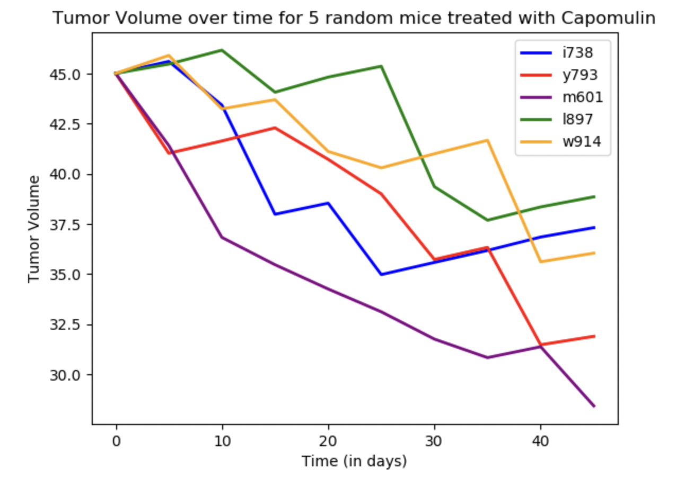
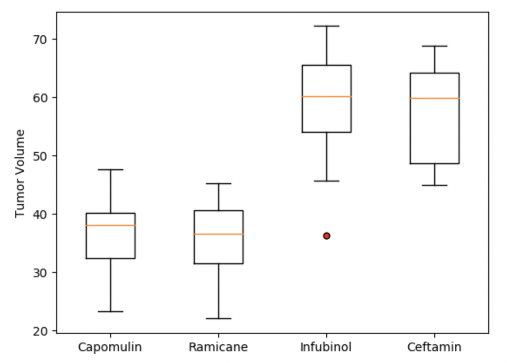
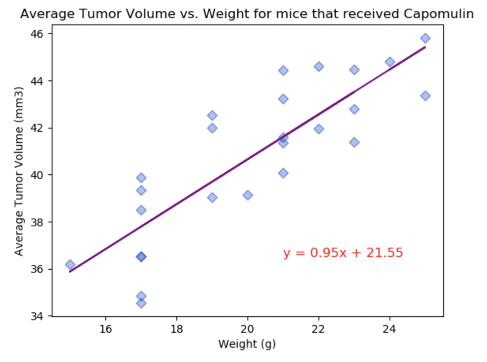

# matplotlib-challenge - Tyler Hill - 4/16/22

The purpose of this repository is to demonstrate our continued proficiency in deriving valuable insights from data using Pandas, 
and expanding on that understanding by plotting the data with Pandas and Matplotlib to create visual representations of those insights.

The methods used in this exercise include generating summary statistics, bar and pie charts, line plots and scatter plots with 
regression and Pearson r values, calculation of quartiles, IQR, and finding outliers.

